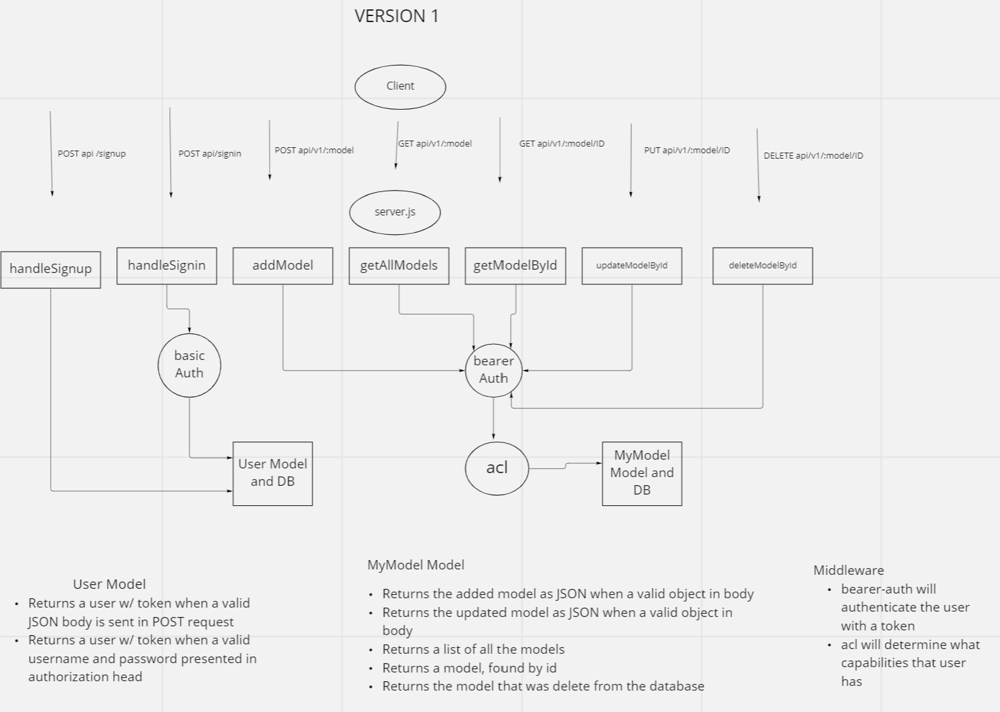

# Auth API Server

**Author**: Brooke Heck

**Version**: 1.0.0

## Overview
This is a basic REST api that uses basic authentication for sign in and bearer auth for all other routes. The routes for reading, creating, updating, and deleting also include acl middleware which determines what permissions the user has.

## Deployed Server
[https://bh-auth-api.herokuapp.com](https://bh-auth-api.herokuapp.com/)

## Architecture and Routes

The user can sign up using that route, and is put in a db with their role and hashed password. Basic authentication is used for sign in and compares hashes to authenticate from user. If the user is valid, they are given a token. The token is used to authenticate for all other routes, and the acl middleware will also determine what permissions the user has before requests are handled.

## Change Log
09-28-2022 10:00am - user sign up creates a user and stores it in db with capabilities and hashed password
09-28-2022 10:00am - routes use bearer authentication with json web token
09-28-2022 11:55am - routes are protected with acl middleware that only lets user make requests they have permissions for
